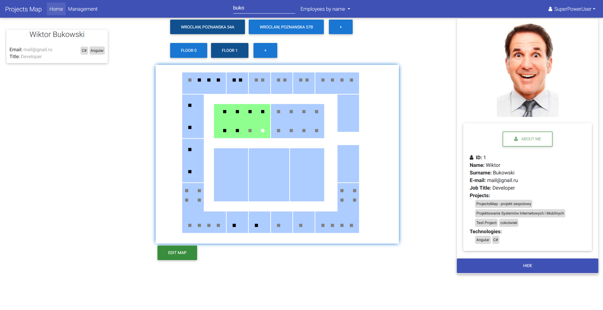
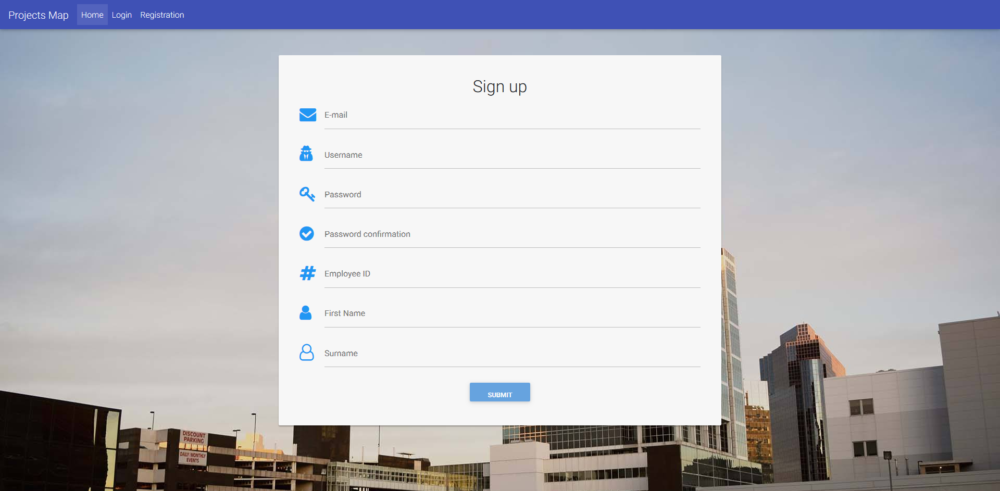
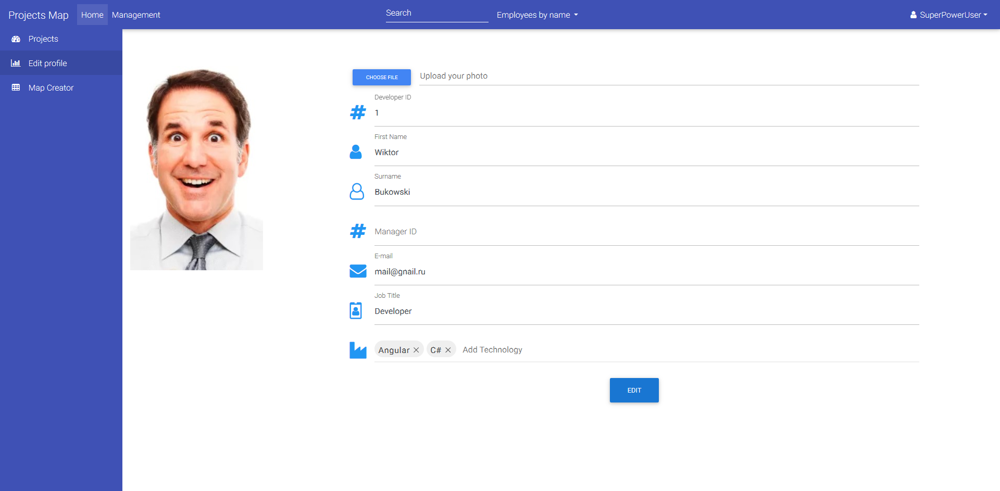
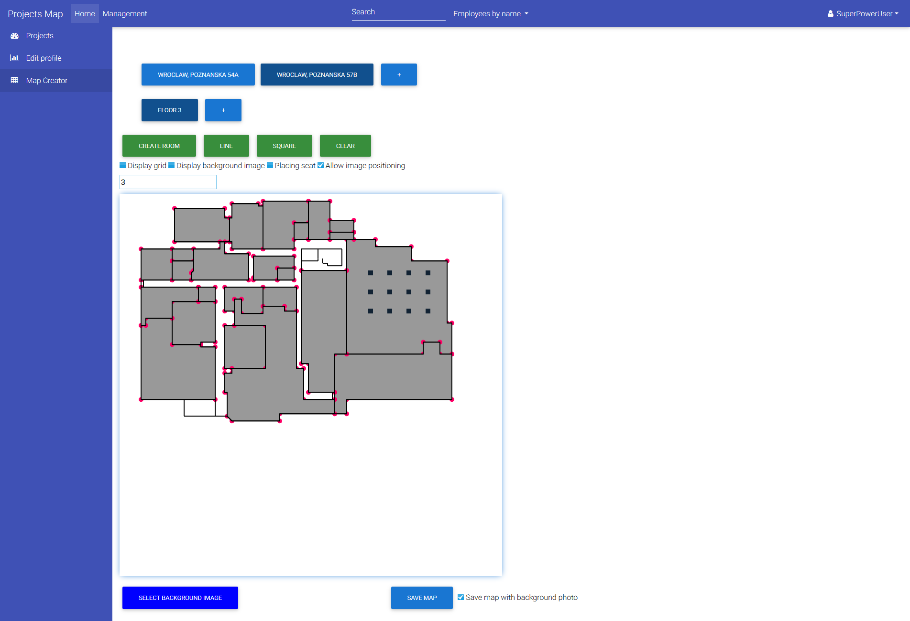

# InnovativeProjects - Projects Map
# 
<table>
<tr>
<td>
  Our application will help companies to improve cooperation between employees, by providing an easy way to locate person, that can give us a hand with given technology. With few easy steps you can locate someone in the office or find information about all projects in the company. Our tool is flexible - it gives the possibility to draw a map of the building's floors for company of any size.
</td>
</tr>
<tr>
<td>
We've created Web Application and Android Application. 
</td>
</tr>
</table>

## Site

### Registration form
### 

### Editing profile
### 

### Creating map
### 

## Usage

## Built with 

- [Angular 5](https://angular.io/) - a TypeScript-based open-source front-end web application platform. Used as frontend.
- [Bootstrap](http://getbootstrap.com/) - an open source toolkit for developing with HTML, CSS, and JS. Addition to frontend.
- [ASP.NET Web API](https://www.asp.net/web-api) - a framework that makes it easy to build HTTP services that reach a broad range of clients, including browsers and mobile devices. Used as backend.

## How To Use

To clone and run this application, you'll need [Git](https://git-scm.com) and [Node.js](https://nodejs.org/en/download/) (which comes with [npm](http://npmjs.com)) installed on your computer. From your command line:

```bash
# Clone this repository
$ git clone https://github.com/nokia-wroclaw/innovativeprojects-projects-map

# Go into the repository
$ cd innovativeprojects-projects-map/Frontend/Project-Map

# Install AngularCLI
$ npm install -g @angular/cli

# Run the app
$ ng serve
```

Note: If you're using Linux Bash for Windows, [see this guide](https://www.howtogeek.com/261575/how-to-run-graphical-linux-desktop-applications-from-windows-10s-bash-shell/) or use `node` from the command prompt.


## Team

[](https://github.com/wbstudent) | [](https://github.com/michal4237) | [](https://github.com/SebastianBienert) | [](https://github.com/emem1928) | [](https://github.com/mattho1) | [](https://github.com/Leny1996)
---|---|---|---|---|---
[Wiktor Bukowski](https://github.com/wbstudent) | [Michał Radziwiłko](https://github.com/michal4237) | [Sebastian Bienert](https://github.com/SebastianBienert) | [Maciej Szczelina](https://github.com/emem1928) | [Mateusz Thomas](https://github.com/mattho1) | [Damian Strycharczuk](https://github.com/Leny1996)

## [License](https://github.com/nokia-wroclaw/innovativeprojects-projects-map/blob/master/LICENSE)
MIT